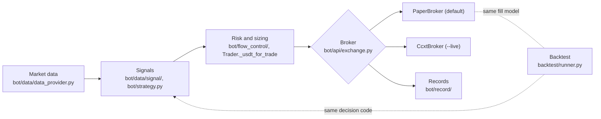
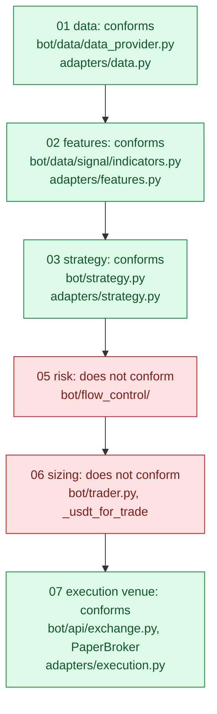

# Crypto trading pipeline

[](https://github.com/oscar-chw/crypto-trading-pipeline/actions/workflows/ci.yml) [](https://github.com/oscar-chw/crypto-trading-pipeline/actions/workflows/lint.yml)

After the WQT 2025 hackathon, I rebuilt my competition bot into a general, exchange-agnostic trading pipeline
built on my [crypto-desk-blueprint](https://github.com/oscar-chw/crypto-desk-blueprint). It reads market
prices, decides when to buy or sell, limits its own losses, and sends market orders through a broker you
choose: a paper broker by default, or any exchange ccxt supports. A backtester replays past prices through
the same decision code offline. The bundled strategy is an example, not a claim of profit. Written by Oscar Choi.

## Why this exists

A trading bot is mostly plumbing: fetching candles, turning them into a decision, sizing and protecting
the position, sending orders and confirming fills, and keeping a record that adds up. This repository
keeps that plumbing working and testable with no exchange keys at all.

## Approach: what the pipeline does

`reference/` holds the code; paths below are relative to it. The live loop (`bot/trader.py`,
`Trader.run_once`) runs these stages for each enabled coin, every cycle:

1. **Market data**: candles and order books from Binance through ccxt, with a Horus fallback when
   configured (`bot/data/data_provider.py`). Each coin is refetched at most every 0.25 s
   (`bot/trader.py`, `fetch_pair`).
2. **Calculation**: MACD, RSI, Bollinger bands and a volume average (`bot/data/signal/indicators.py`);
   one `check(indicators) -> bool` per signal (`bot/trading_logic/signal/`), including bullish
   engulfing and order-book imbalance. `bot/strategy.py` turns them into the entry decision
   (`entry_mode`: any two signals, or all).
3. **Risk and sizing**: a portfolio drawdown guard (10% below starting equity, three cycles in a
   row), a per-coin daily loss cap that liquidates, a 72 h holding limit, and a tiered exit ladder:
   stop at -2%, sell 30% at +1.5% and move the stop to cost, sell 30% at +3%, exit at +5%, every
   level net of fees (`bot/flow_control/stop_loss_take_profit.py`). Size is a per-coin allocation
   less a fee cushion, capped by the broker's free USDT (`Trader._usdt_for_trade`).
4. **Execution**: **market** orders through an injected broker (`bot/api/exchange.py`). The fill is
   polled up to three times, and a position opens or closes only on a confirmed `FILLED`
   (`Trader._submit_buy`, `_submit_sell`). Two brokers implement the same three methods
   (`place_market_order`, `query_order`, `fetch_balance`):
   - `PaperBroker`, the default: fills at the next quoted price with the backtester's fee and slippage
     model (it wraps `backtest/runner.py`'s `BacktestBroker`), and rejects an order the paper account
     cannot cover in full;
   - `CcxtBroker`: live spot orders on any ccxt exchange, quantity rounded to the market's precision;
     only a `closed` order filled to its full amount counts as `FILLED`.

   Operator tools for a live account: slow-stop (no new entries), pending, cancel, liquidate and
   profile (`bot/console/`).
5. **Recording**: every order and close goes to a daily JSONL file and a CSV mirror
   (`bot/record/recorder.py`); the daily P&L file reads the JSONL so each close counts once
   (`bot/flow_control/daily_rollover.py`).
6. **Backtest**: `backtest/runner.py` replays candles through the same indicator, strategy and
   exit-ladder functions, with the simulated broker (fills at the bar close plus slippage and fees).



## Results

Engineering results only; no trading P&L is claimed.

| What | Result | Evidence |
|---|---|---|
| Test suite | 56 tests in three tiers (38 case, 14 integration, 4 property) pass | `bash scripts/check.sh` |
| Blueprint conformance | 58 conformance tests pass against the adapters (data 3, features 17 x 3, strategy 3, execution venue 1) | `bash scripts/conformance.sh` |
| Paper fills cost what backtest fills cost | `PaperBroker` buy and sell match `BacktestBroker` price and fee exactly | [test_exchange.py](reference/tests/case/test_exchange.py) |
| Only a confirmed fill opens a position | an order left `OPEN` places no position; a partly filled ccxt order is not `FILLED` | [test_live_loop.py](reference/tests/integration/test_live_loop.py), [test_exchange.py](reference/tests/case/test_exchange.py) |
| Adapters decide what the bot decides | adapter entry signal equals the backtester's at all 130 bars checked; every feature equals `compute_indicators` | [test_adapters_match_bot.py](reference/tests/integration/test_adapters_match_bot.py) |
| Backtest uses the live decision | live loop and backtester agree on the entry decision at all 130 bars checked | [test_backtest_matches_live.py](reference/tests/integration/test_backtest_matches_live.py) |
| Offline backtest (SYNTHETIC data) | 4 coins x 1,500 hourly bars replayed in about 6 s (about 1,000 bars/s, one laptop) | [synthetic-backtest.json](reference/results/synthetic-backtest.json), `bash scripts/demo.sh` |
| Daily P&L counts each close once | the original reader summed the JSONL and CSV copies (each close twice); fixed | [test_daily_pnl.py](reference/tests/case/test_daily_pnl.py), [test_invariants.py](reference/tests/property/test_invariants.py) |
| Live start without keys | `--live` exits naming the missing variables, before writing anything | [test_cli.py](reference/tests/integration/test_cli.py) |

## Run it offline

```bash
python3.11 -m venv .venv && .venv/bin/pip install -r requirements.txt
bash scripts/check.sh      # ruff, mypy, three test tiers, blueprint conformance, then the demo; 0 only if all pass
bash scripts/demo.sh       # offline backtest on SYNTHETIC candles, no API keys
```

The demo writes 4 coins x 1,500 hourly SYNTHETIC candles, replays them, and fails unless the result
matches [reference/results/synthetic-backtest.json](reference/results/synthetic-backtest.json).

## Paper or live trading

```bash
# paper trading on live prices (public market data, no keys; starts with initial_capital_in_usd)
PYTHONPATH=reference python -m bot.trader

# live trading through ccxt: real money
export CTP_EXCHANGE=binance CTP_API_KEY=... CTP_API_SECRET=...
PYTHONPATH=reference python -m bot.trader --live
```

`--live` refuses to start, naming the missing variables, unless all three are set (from the
environment or a local `.env`, which is git-ignored). The tests never construct a live broker against a
real exchange. Settings live in `reference/bot/config/config.yaml`; it is re-read every cycle.

## Project structure

```
reference/bot/        live loop: api/ (exchange.py brokers, ccxt and Horus market data), data/,
                      trading_logic/signal/, strategy.py, flow_control/ (risk), record/, console/, config/
reference/backtest/   runner.py (offline replay, BacktestBroker), synthetic.py (SYNTHETIC candles)
reference/tests/      case/, integration/, property/ (pytest markers); fakes.py holds FakeBroker
reference/adapters/   thin adapters from the bot to the blueprint's stage Protocols; impl.py feeds the suites
reference/results/    the demo's expected output
third_party/          crypto-desk-blueprint, vendored at a pinned commit (SOURCE.md says why and how to update)
scripts/              check.sh, conformance.sh, demo.sh, env.sh
```

### Design decisions and trade-offs

- **One broker interface, injected.** `Trader(config_path, broker=, market_data=)`. Paper, live and
  test brokers are interchangeable, so the order path is tested end to end with no network.
- **Market orders, confirmed fills.** The trader trusts a position only after `FILLED`. Simpler to
  reason about than resting orders, at the cost of slippage control.
- **Paper is the default, live is opt-in.** Real money needs `--live` and three variables; nothing
  falls back to a default key.
- **One JSONL copy is canonical.** The CSV stays for spreadsheets; readers must pick one copy.
- **Swapping the strategy.** A strategy is two functions in `bot/strategy.py`:
  `signal_statuses(indicators, flags, orderbook, price, ob_config) -> {name: bool}` and
  `entry_signal_ok(statuses, flags) -> bool`; exits are `evaluate_dynamic_sl_tp(position, price,
  cfg, ...) -> {action, sell_fraction, new_stop, tier}`. Both the live loop and the backtester call
  these, so a replacement is tested offline before it trades.

## Limits

- The backtester replays the primary timeframe only: order-book signals count as not fired, and the
  higher/micro timeframes and the execution filters are live-only (it prints which are switched on).
- The configured order rate limit is built but never enforced (`RateLimiter.allow` is not called).
- Partial take-profits are not written as trade closes, so the daily P&L file undercounts them.
- A position records the decision price and requested quantity, not the broker's fill price.
- `PaperBroker` keeps its account in memory: a restart starts again from `initial_capital_in_usd`.
- `entry_mode: all` needs every `ob_*` key listed in the config; an unlisted one blocks entries.
- The demo data is SYNTHETIC; it shows the pipeline runs, not that the strategy works.

## Blueprint conformance

The general design lives in [crypto-desk-blueprint](https://github.com/oscar-chw/crypto-desk-blueprint):
a typed Protocol per stage and conformance suites an implementation must pass. Its `pipeline/` and
`conformance/` are vendored unmodified at commit `8509898` in `third_party/crypto-desk-blueprint`.
`reference/adapters/` maps the pipeline onto the Protocols it can honestly implement; the adapters only
translate types.



| Stage | Protocol | Status |
|---|---|---|
| 01 data | `DataSource` | conforms. `fetch_ohlcv` rows become bars stamped at close; the still-forming candle is dropped. It serves only the latest `limit` bars, so an older window comes back short |
| 02 features | `Feature` | conforms, all 13 `compute_indicators` outputs plus the 4 lags the strategy reads. MACD and RSI are EWMs seeded at bar 1, so their declared lookback is 1 and 2: the bot relies on `WARMUP_BARS` and a 200-bar window, not on NaN warm-up |
| 03 strategy | `Strategy` | conforms for the default signals (MACD, RSI, engulfing); score 1 on entry, else 0. Bollinger, volume and price signals read series the adapter does not map, so it refuses a config that enables them |
| 04 pricing | `PricingModel` | not implemented: spot only, no forwards or funding |
| 05 risk | `RiskModel`, `RiskGate` | does not conform: no volatility forecast, and the guards (drawdown stop, per-coin loss cap, exit ladder) act on positions, not on target weights, so there are no weight or gross caps to pass AT-05-5 |
| 06 portfolio | `PortfolioConstructor` | does not conform: `_usdt_for_trade` is a fixed USD notional per coin; it ignores volatility (AT-06-3) and takes no signals or risk forecast |
| 07 execution | `ExecutionVenue` | conforms: `PaperBroker` prices each fill (slippage and fee per side). `CcxtBroker` is not wrapped, so the suites never reach an exchange |
| 07 execution | `Executor` | not implemented: orders come from per-coin entry and exit rules, not target weights; only the venue test of stage 07 runs |
| 00, 08 | clock, store, CV | not implemented |

## Lessons

- One decision path for backtest and live. The first backtester imported older copies of the bot's modules, so
  it could disagree with what traded; it now imports the bot itself, and a test checks both agree bar by bar.
- Execution belongs behind an interface. The first version called one exchange's REST client from inside the
  trader, so the order path could only be tested against that exchange. With an injected broker the same code
  paper-trades, trades live through ccxt, and runs under test with a fake.
- Records written twice must be counted once. Every close was logged to JSONL and CSV, and the daily P&L read both,
  doubling every close; it now reads one copy, with a test.
- Conformance tests find bugs unit tests missed. The blueprint's warm-up test (AT-02-2) failed on RSI: with no
  losing bar yet the average loss is 0 and RSI came out NaN instead of 100, so a static-mode "RSI > 70" exit
  could not fire on a run of gains. Fixed in `indicators.py`, with [test_indicators.py](reference/tests/case/test_indicators.py).
- A safety guard must block entries, not exits. The drawdown guard used to end the cycle early, which also switched off
  stop-loss and take-profit on open positions; it now blocks new entries only, with a test.
- Fail closed on credentials: live start refuses without its keys instead of falling back to defaults.

## Credits and licence

Oscar Choi wrote the original bot; this rebuild, the tests and the blueprint adapters were implemented with
AI coding agents under Oscar's design and review. Apache License 2.0 ([LICENSE](LICENSE)).
